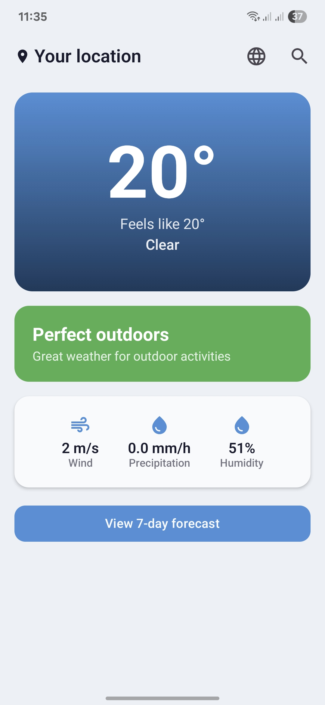
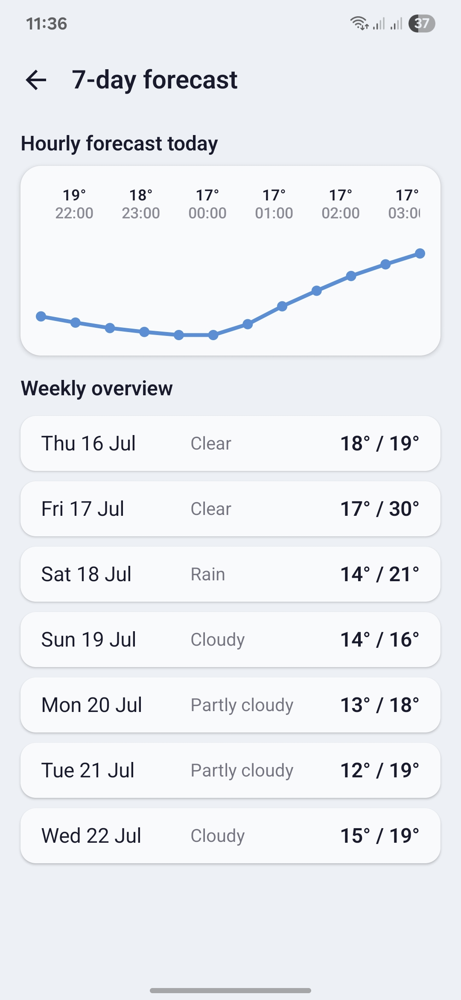
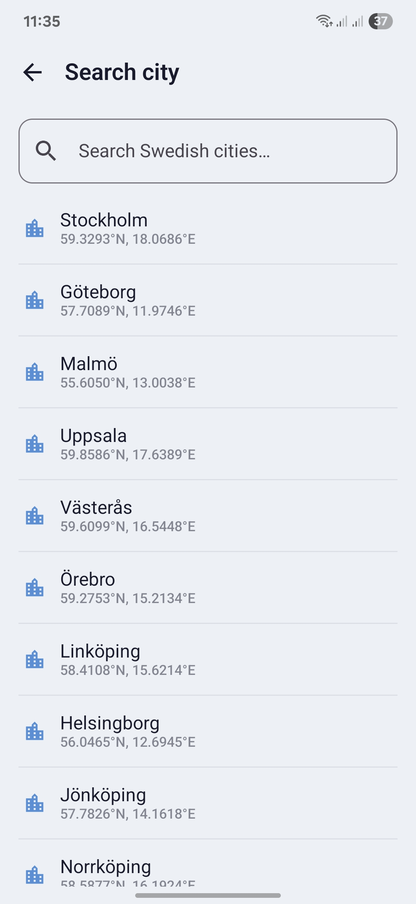

# FriLuft

**Väder för friluftsliv — när det är värt att gå ut.**

A clean Android weather app built for the Swedish market. FriLuft tells you not just what the weather is, but whether it's worth going outside — with a daily Outdoor Score that rates conditions for outdoor activities.

## Screenshots

<p align="center">
  
  
  
</p>

## What it does

Most weather apps show you numbers. FriLuft tells you what those numbers mean for getting outside. Temperature, wind, and precipitation are combined into a single Outdoor Score — **Perfekt utomhus**, **Går bra**, or **Stanna inne** — with a plain-Swedish reason why.

Current weather is fetched from SMHI's free open-data API — the same data used by Swedish broadcasters. No API key required, no account needed, no ads.

## Features

- Current weather: temperature, feels-like, wind, precipitation, humidity
- Outdoor Score: rates each day for outdoor activity in plain Swedish
- 7-day daily forecast with min/max temperatures
- Hourly temperature chart for today (12 hours)
- City search across 27 Swedish cities
- GPS auto-detection with Swedish reverse geocoding
- 30-minute weather cache — works offline after first load
- Fully Swedish UI

## Tech stack

- Kotlin + Jetpack Compose
- MVVM + Clean Architecture
- Room (offline weather cache)
- Hilt (dependency injection)
- Retrofit + Moshi (SMHI API)
- Navigation Compose
- FusedLocationProvider (GPS)
- DataStore (persisted city preference)

## Data source

Weather data from [SMHI Open Data](https://opendata.smhi.se/) — Swedish Meteorological and Hydrological Institute. Free to use, no API key required.

## Requirements

- Android 8.0 (API 26) or higher
- Google Play Services (for GPS)

## Project structure

```
app/src/main/java/se/w3footprint/friluft/
│
├── data/
│   ├── local/          # Room database, DAO, WeatherCacheEntity, DataStore
│   ├── remote/         # SMHI API, DTOs, mapper
│   └── repository/     # WeatherRepositoryImpl
│
├── domain/
│   ├── model/          # CurrentWeather, HourlyForecast, DailyForecast, OutdoorScore, City
│   ├── repository/     # WeatherRepository interface
│   └── usecase/        # GetCurrentWeatherUseCase, GetOutdoorScoreUseCase, etc.
│
├── presentation/
│   ├── home/           # HomeScreen, HomeViewModel, HomeUiState
│   ├── forecast/       # ForecastScreen, ForecastViewModel, ForecastUiState
│   ├── search/         # SearchScreen, SearchViewModel
│   ├── navigation/     # FriLuftNavGraph, Screen
│   └── common/theme/   # Color, Theme, Type
│
└── di/                 # NetworkModule, DatabaseModule, RepositoryModule
```

## Build

Clone and open in Android Studio Hedgehog or later. No API keys or configuration files needed — sync Gradle and run.

```bash
./gradlew assembleDebug
```

## Company

Built by [W3Footprint](https://w3footprint.se) — Sweden.
